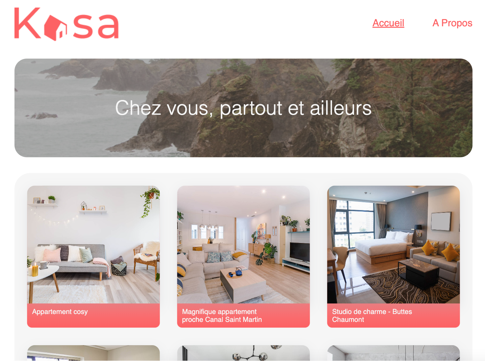

# Kasa Projet VII Openclassrooms

## Formation OpenClassrooms: Développeur Web

Le projet consiste à developper le front-end de la plateforme Web,
Kasa qui est un site de location d'appartements entre particulier situé en France.
Le projet a été développé sous Javascript dans le but de fonctionner avec NodeJS côté back-end.
Le design de l'interface a été défini d'après la maquette Figma, communiqué par Paul et est consultable [ici](https://www.figma.com/file/bAnXDNqRKCRRP8mY2gcb5p/UI-Design-Kasa-FR?node-id=3%3A0)

Le projet s'appuie sur différents composants React, les couleurs du css sont centralisées et modifiables dans le fichiers variables.scss.

De plus l'ensemble du site est responsive.

### Technologies utilisées :

`React`
`SCSS`
`NPM`
